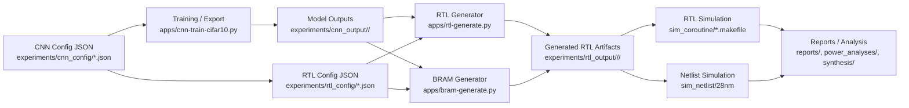

# Architecture Overview

## Main Entry Points

- Training: `apps/cnn-train-cifar10.py`
- RTL generation: `apps/rtl-generate.py`
- BRAM generation: `apps/bram-generate.py`
- RTL simulation: `sim_coroutine/`
- Netlist simulation: `sim_netlist/`

## Typical Artifact Path

`experiments/rtl_output/<cnn_config>/<rtl_config>/`

